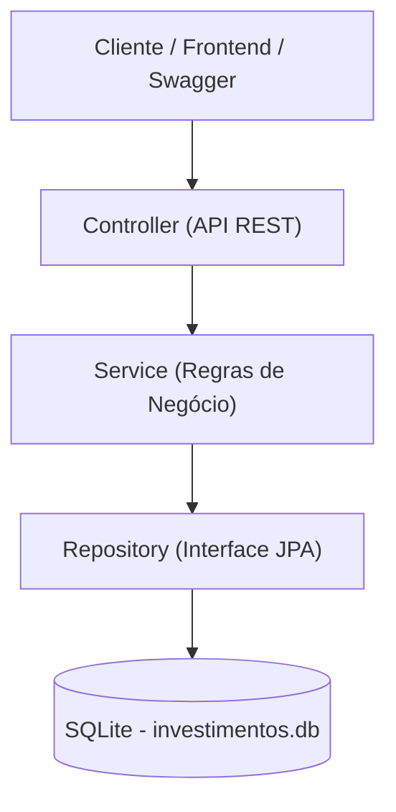
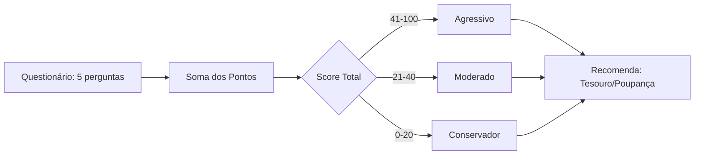

# 📊 Painel de Investimentos - Desafio Caixa Verso


API REST desenvolvida em Java 21 + Spring Boot 3 para simulação de investimentos, análise de perfil de risco (Suitability) e recomendação de produtos.

---

## 🗺️ Arquitetura e Fluxos

### 🏛️ Desenho da Arquitetura

---
## 🧠 Fluxo do Suitability (Perfil de Risco)

# 🧱 Arquitetura da Aplicação

* **Camada Controller** – Expõe os endpoints REST
* **Camada Service** – Regras de negócio (simulação, perfil de risco, recomendação)
* **Camada Repository** – Persistência usando Spring Data JPA
* **Banco SQLite** – Persiste os dados em arquivo (`investimentos.db`)

**Por que SQLite?**

* **Persistência real em disco** (diferente do H2, que apaga tudo ao desligar)
* **Portabilidade** Ideal para containers Docker
* **Zero dependências** Não exige instalação de SGBD na máquina do avaliador do PSI
* **Reproduz melhor um banco de dados real para o desafio**

---

# 🛠 Tecnologias Utilizadas

* **Java 21**
* **Spring Boot 3**
* **SQLite**
* **Spring Data JPA**
* **Docker**
* **Lombok**
* **JUnit 5** (Testes automatizados)
* **OpenAPI / Swagger** (Documentação Interativa)
* **GitHub Actions** (CI/CD Pipeline)

---

# ▶️ Como Rodar o Projeto

## **1. Via Maven**
Na raiz do projeto, execute:
```bash

mvn spring-boot:run
```

Acesse:
👉 **http://localhost:8081/swagger-ui/index.html**

---

## **2. Via Docker**

```bash

docker build -t investimento-api .
docker run -p 8081:8081 investimento-api
```

---
# 📚 Documentação Interativa (Swagger)
O projeto possui documentação automática. Após iniciar a aplicação, acesse:

👉 Swagger UI: http://localhost:8081/swagger-ui/index.html 

👉 JSON Docs: http://localhost:8081/v3/api-docs

---

# 🧪 Testes Automatizados

O projeto contém testes **unitários** (regra de negócio) e **de integração**:

```bash

mvn test
```

---

# 📚 Endpoints da API


---

## 🔎 1. Health Check

**GET** `http://localhost:8081/health`

**Resposta:**

```json
{"status": "UP"}
```

---

## 💰 2. Simular Investimento

**POST** `http://localhost:8081/simular-investimento`

**Body:**

```json
{
  "clienteId": 123,
  "valor": 10000,
  "prazoMeses": 12,
  "tipoProduto": "CDB"
}
```

**Como funciona a simulação?**
O cálculo utiliza **juros simples** com base na rentabilidade do produto.

---

## 📜 3. Consultar Histórico de Simulações

**GET** `http://localhost:8081/simulacoes`

---

## 🧩 4. Identificar Perfil de Risco (Suitability)

**POST** `http://localhost:8081/perfil-risco`

**Body(Pontuação de 0, 10 ou 20 por resposta):**

```json
{
  "toleranciaRisco": 10,
  "horizonte": 10,
  "conhecimentoFinanceiro": 10,
  "objetivo": 10,
  "situacaoFinanceira": 10
}
```

**Classificação:**

* **0–20** → Conservador
* **21–40** → Moderado
* **41–100** → Agressivo

*(Validação forte com Jakarta Validation: todos os campos aceitam apenas 0, 10 ou 20.)*

---

## 🎯 5. Recomendação de Produtos

**GET** `http://localhost:8081/produtos-recomendados/{perfil}`

Exemplo:

`
http://localhost:8081/produtos-recomendados/Conservador
`

---

## 📈 6. Telemetria de Endpoints

**GET** `http://localhost:8081/telemetria`

Retorna a quantidade de chamadas registradas por serviço.

---

# 👩‍💻 Autora

**Patrícia Nunes Pessoa**

Matrícula: **c118385-3**

---

# 🎯 Observação Final

API preparada para avaliação técnica, com:

* Testes
* Telemetria
* Suitability implementado
* Banco persistente
* Dockerfile funcional

---


